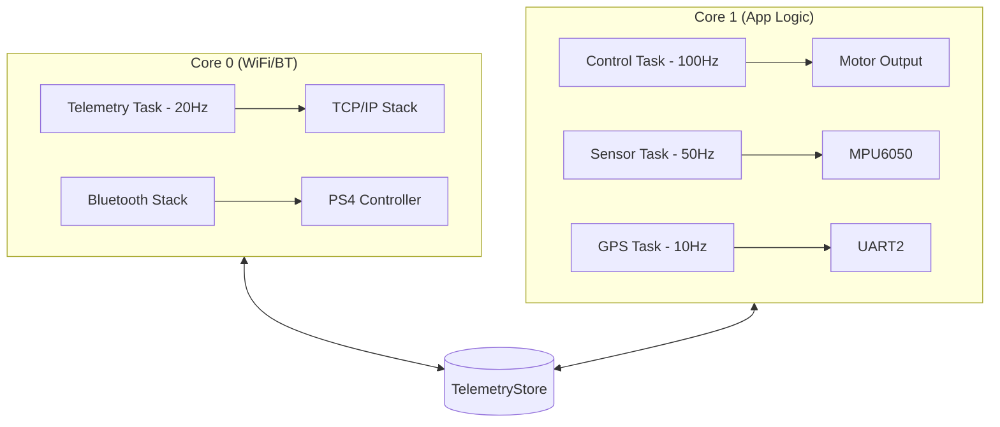

# DeeThunder RC Car — Pro Firmware

**High-performance, bare-metal RC car firmware for the Original ESP32 Classic.**  
Designed for sub-millisecond control latency, real-time telemetry, and rugged stability using a PS4 DualShock 4 controller.

---

## 🚀 Key Features

- **🎮 PS4 DualShock 4 Integration**: Direct Bluetooth Classic connection with 10ms polling.
- **📡 Bare-Metal Telemetry**: Custom RFC 6455 WebSocket implementation (zero-heap) for 20Hz live dashboard streaming.
- **🛰️ Sensor Fusion**: Raw I2C MPU6050 driver for Roll/Pitch estimation and impact detection.
- **📍 GPS Integration**: Custom NMEA parser (UART2) for position, altitude, and speed tracking.
- **⚡ 3S Li-ion Management**: Built-in battery monitor for 9.0V - 12.6V setups with percentage mapping.
- **📳 Haptic Feedback**: Dynamic controller vibration based on G-force impacts and speed thresholds.
- **🧵 FreeRTOS Optimized**: Asynchronous multi-core job distribution (Core 0: WiFi/BT, Core 1: Control/Sensors).

---

## 🛠️ Technical Stack

This project deliberately avoids bloated Arduino libraries in favor of bare-metal implementations:
- **WebSockets**: Custom TCP-based handshake and framing (No `ESPAsyncWebServer`).
- **JSON**: Stack-allocated `snprintf` builder (Zero `ArduinoJson` heap fragmentation).
- **MPU6050**: Raw I2C register access (No 100KB+ generic IMU libraries).
- **GPS**: High-speed circular UART buffer processing.

---

## 🔌 Hardware Guide (ESP32 Classic)

> [!CAUTION]
> This config is optimized for **ESP32-WROOM-32**. Do not use GPIOs 6–11 as they are connected to internal SPI Flash and will crash the MCU.

### Pin Mapping
| Component | Function | GPIO | Notes |
| :--- | :--- | :--- | :--- |
| **Motors** | ENA (PWM) | **25** | Left side speed |
| | IN1 / IN2 | **26 / 27** | Left side direction |
| | ENB (PWM) | **14** | Right side speed |
| | IN3 / IN4 | **32 / 33** | Right side direction |
| **MPU6050** | SDA / SCL | **21 / 22** | Hardware I2C |
| **GPS** | TX / RX (ESP) | **17 / 16** | Hardware UART2 |
| **Battery** | ADC | **34** | **ADC1 Only** (WiFi safe) |

### Power System (3S Li-ion)
- **Battery**: 11.1V Nominal (12.6V Full)
- **Voltage Divider**: **100kΩ / 30kΩ** connected to GPIO 34.
- **Logic**: All sensors (MPU/GPS) must be powered from the **3.3V pin** of the ESP32 to maintain logic compatibility on communication lines.

---

## 🏗️ Software Architecture

### Task Distribution


---

## 🧪 Unit Testing

The project includes a robust testing suite for verifying logic without hardware:
- **Math Verification**: Pitch/Roll trigonometry and ADC-to-Percent curves.
- **Protocol Checks**: WebSocket JSON syntax and NMEA parsing.

**To run tests:**
```bash
pio test -e esp32dev
```

---

## 🚀 Deployment

1. **Clone the Repo**:
   ```bash
   git clone https://github.com/Deethunder/rc_car.git
   ```
2. **Set Credentials**:  
   Update `src/config.h` with your WiFi SSID, Password, and your PS4 MAC Address.
3. **Upload Filesystem (SPIFFS)**:
   ```bash
   pio run --target uploadfs
   ```
4. **Flash Firmware**:
   ```bash
   pio run --target upload
   ```

---

## 📈 Dashboard Features

- **Live Speedometer**: Real-time speed from GPS.
- **Horizon Line**: Attitude Indicator using MPU6050 Fusion.
- **Battery Health**: Dynamic voltage bar with low-power alerts.
- **Motor Loads**: Visual representation of PWM duty cycles.
- **System Stats**: Memory heap and task uptime tracker.

---

## 📄 License & Credits
Developed by **DeeThunder Nexus Ventures**.  
For professional reproduction or licensing, please contact us at [your-email@example.com].
